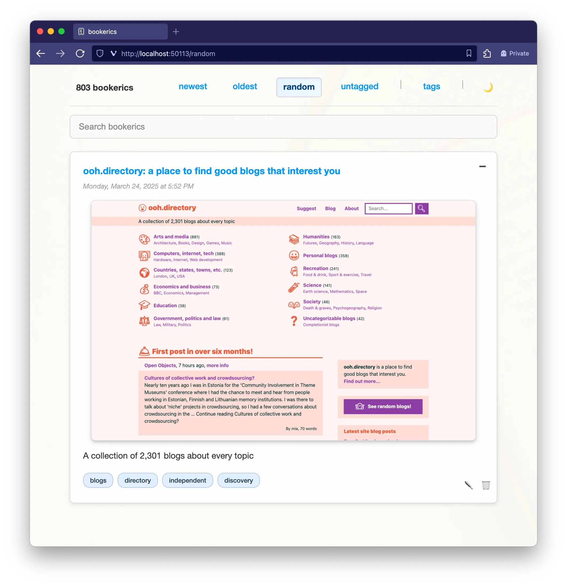

# `bookerics`

> bookmarks, but for Erics

**`bookerics`** is a modern, self-hosted bookmark manager that combines simplicity with powerful features. Think of it as a personal alternative to [Pinboard](https://pinboard.in/) with intelligent tagging, automatic screenshots, RSS feeds, and seamless cloud synchronization.



## ✨ Features

### 📚 Core Functionality
- **Smart Bookmark Management** - Save, organize, and search your bookmarks with ease
- **Automatic Screenshots** - Visual previews of your bookmarks using website thumbnails
- **AI-Powered Tagging** - Intelligent tag suggestions using OpenAI's GPT models
- **Full-Text Search** - Search through titles, descriptions, and tags
- **RSS Feed Generation** - Automated RSS feeds for all bookmarks or specific tags

### 🎨 User Experience
- **Keyboard Shortcuts** - Navigate and manage bookmarks without touching your mouse
- **Dark/Light Theme Toggle** - Comfortable viewing in any lighting condition
- **Infinite Scroll** - Seamless browsing through large bookmark collections
- **Responsive Design** - Works beautifully on desktop and mobile devices
- **Browser Extension** - One-click bookmark saving with pre-filled metadata

### 🔧 Technical Features
- **AWS S3 Integration** - Automatic cloud backup and screenshot storage
- **Local & Cloud Sync** - Database automatically synced to S3 for redundancy
- **Multiple View Modes** - Newest, oldest, random, untagged, and tag-filtered views
- **Customizable Branding** - Easily personalize for your name (booktoms, bookzendayas, etc.)

## 🏗️ Architecture & Tech Stack

### Backend
- **[FastHTML](https://fastht.ml/)** - Modern Python web framework
- **SQLite** - Lightweight, file-based database
- **OpenAI API** - AI-powered tag generation and content analysis
- **shot-scraper** - Website screenshot generation
- **aioboto3** - Async AWS S3 integration

### Frontend
- **[HTMX](https://htmx.org/)** - Dynamic frontend interactions without JavaScript complexity
- **Vanilla JavaScript** - Custom keyboard shortcuts and UI enhancements
- **Modern CSS** - Responsive design with dark/light theme support

### Infrastructure
- **AWS S3** - Cloud storage for database backups, screenshots, and RSS feeds
- **Browser Extensions** - Chrome/Firefox extensions for quick bookmark saving

## 🚀 Quick Start

### Prerequisites
- Python 3.12+
- [uv](https://github.com/astral-sh/uv) package manager
- AWS account (optional, for cloud features)
- OpenAI API key (optional, for AI tagging)

### Installation

```bash
# Install uv if you don't have it
curl -LsSf https://astral.sh/uv/install.sh | sh

# Clone the repository
git clone https://github.com/ehamiter/bookerics.git
cd bookerics

# Set up environment
cp .env.example .env
# Edit .env with your configuration

# Run the application
uv run bookerics
```

The application will be available at `http://localhost:50113`

### Environment Configuration

Create a `.env` file with your settings:

```env
# Basic Configuration
BOOKMARK_NAME=bookeric  # Customize your bookmark terminology

# AWS S3 (for cloud sync and screenshots)
AWS_S3_BUCKET=your-bucket-name
AWS_DEFAULT_REGION=us-east-1
AWS_ACCESS_KEY_ID=your-access-key
AWS_SECRET_ACCESS_KEY=your-secret-key

# OpenAI (for AI tagging)
BOOKERICS_OPENAI_KEY=your-openai-api-key

# Optional: Giphy (for placeholder images)
GIPHY_API_KEY=your-giphy-api-key

# Optional: Local backups
LOCAL_BACKUP_PATH=/path/to/backup/directory
```

## 📱 Browser Extension

`bookerics` includes browser extensions for Chrome and Firefox that enable one-click bookmark saving:

### Chrome Extension
```bash
cd tools/bookerics_browser_extension
# Load as unpacked extension in Chrome developer mode
```

### Firefox Extension
```bash
cd tools/bookerics_firefox_extension
# Load as temporary add-on in Firefox
```

**Usage**: Click the extension icon or press `Cmd+D` to open a bookmark modal pre-filled with the current page's title and description.

## ⌨️ Keyboard Shortcuts

### Navigation
- **J** - Navigate down to the next bookmark
- **K** - Navigate up to the previous bookmark

### Actions
- **V** - Open the selected bookmark's URL in a new browser tab
- **E** - Edit the selected bookmark (opens modal)
- **X** - Delete the selected bookmark (requires confirmation)

### Interface
- **Cmd+K** (Mac) / **Ctrl+K** (Windows/Linux) - Focus the search bar
- **Escape** - Unfocus search bar or close modals
- **Cmd+Shift+D** - Toggle between dark and light themes
- **?** - Show keyboard shortcuts help

## 📡 RSS Feeds

`bookerics` automatically generates RSS feeds for your bookmarks:

- **Main Feed**: `/feeds/rss.xml` - All bookmarks
- **Cloud Hosted**: Feeds are automatically uploaded to S3 for external access

RSS feeds include:
- Bookmark metadata (title, description, URL)
- Screenshot thumbnails as enclosures
- Tags as categories
- Proper RSS 2.0 formatting with XSL styling

## 🔄 Data Management

### Import Existing Bookmarks

Use the blazing fast 🔥 companion [bookerics-importer](https://github.com/ehamiter/bookerics-importer) tool to convert browser bookmarks:

```bash
git clone https://github.com/ehamiter/bookerics-importer.git
cd bookerics-importer
cargo build --release

# Convert bookmarks.html to bookerics.db
./target/release/bookerics_importer /path/to/bookmarks.html bookerics.db
```

### Backup & Sync

- **Automatic S3 Sync**: Database and screenshots automatically backed up to S3
- **Manual Backup**: Click the bookmark count to trigger immediate backup
- **Local Backups**: Optional local backup path configuration

## 🚀 Deployment

### Development
```bash
uv run bookerics
```

### Production (macOS with launchd)

Create `~/Library/LaunchAgents/com.bookerics.plist`:

```xml
<?xml version="1.0" encoding="UTF-8"?>
<!DOCTYPE plist PUBLIC "-//Apple//DTD PLIST 1.0//EN" "http://www.apple.com/DTDs/PropertyList-1.0.dtd">
<plist version="1.0">
<dict>
    <key>Label</key>
    <string>com.bookerics</string>
    <key>ProgramArguments</key>
    <array>
        <string>/Users/YOUR_USERNAME/.local/bin/uv</string>
        <string>run</string>
        <string>bookerics</string>
    </array>
    <key>WorkingDirectory</key>
    <string>/Users/YOUR_USERNAME/bookerics</string>
    <key>StandardOutPath</key>
    <string>/Users/YOUR_USERNAME/Library/Logs/bookerics.log</string>
    <key>StandardErrorPath</key>
    <string>/Users/YOUR_USERNAME/Library/Logs/bookerics.error.log</string>
    <key>KeepAlive</key>
    <true/>
    <key>RunAtLoad</key>
    <true/>
    <key>EnvironmentVariables</key>
    <dict>
        <key>PATH</key>
        <string>/usr/local/bin:/usr/bin:/bin:/usr/sbin:/sbin</string>
    </dict>
</dict>
</plist>
```

**Service Management**:
```bash
# Load and start
launchctl load ~/Library/LaunchAgents/com.bookerics.plist

# Stop and unload  
launchctl unload ~/Library/LaunchAgents/com.bookerics.plist

# Check status
launchctl list | grep bookerics

# View logs
tail -f ~/Library/Logs/bookerics.log
tail -f ~/Library/Logs/bookerics.error.log
```

## 🎯 Use Cases

- **Personal Knowledge Management** - Organize research and reference materials
- **Content Curation** - Collect and categorize interesting articles and resources
- **Team Sharing** - Share curated bookmark collections via RSS feeds
- **Digital Archiving** - Preserve important web content with screenshots
- **Cross-Device Access** - Access bookmarks anywhere with cloud sync

## 📝 Development Status

`bookerics` is actively developed and continuously improving. While stable for daily use, new features are regularly added.

## 🤔 FAQ

**Q. What?**  
A: It's bookmarks, but for Erics. So, `bookerics`. Get it?

**Q: That seems like it's marketed to a very niche group.**  
A: That's not a question.

**Q: Can I use this if my name isn't Eric?**  
A: Sure. If you're not lucky enough to be named Eric, you can update the configuration to be booktoms, bookzendayas, bookvolodymyrs, 
etc. I suppose "bookmarks" works as well.

**Q: Do I need AWS and OpenAI to use `bookerics`?**  
A: No, these are optional features. The core bookmark functionality works without external services, but you'll miss out on screenshots, AI tagging, and cloud sync.

**Q: How does the AI tagging work?**  
A: When you save a bookmark without tags, `bookerics` can automatically analyze the content and suggest relevant tags using OpenAI's GPT models.

---

**Made with ❤️ for bookmark enthusiasts who value simplicity and powerful features.**
